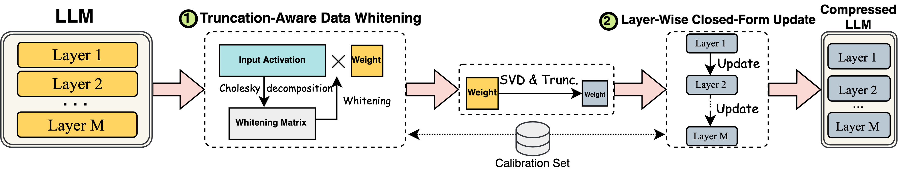

<p align="center">
 <br>
</p>

<div align="center">
<h1>SVD-LLM: Singular Value Decomposition for Large Language Model Compression</h1>
  <div align="center">
  <a href="https://opensource.org/licenses/Apache-2.0">
    
  </a>
  <a href="https://pytorch.org/">
    =v1.7.1">
  </a>
    <a href="https://huggingface.co/docs/transformers/v4.35.2/en/index">
    
  </a>
  <a href="https://github.com/facebookresearch/llama">
    
  </a>
  <a href="https://github.com/facebookresearch/llama">
    
  </a>
  <a href="https://huggingface.co/mistralai/Mistral-7B-v0.1">
    
  </a>
</div>
</div>

<p align="center">
    
</p>


## Brief Introduction
  
> **[SVD-LLM: Singular Value Decomposition for Large Language Model Compression](https://arxiv.org/abs/2403.07378)** [[arXiv]](https://arxiv.org/abs/2403.07378)   
> *Xin Wang<sup>1</sup>, Yu Zheng<sup>2</sup>, Zhongwei Wan<sup>1</sup>, Mi Zhang<sup>1</sup>*   
> *<sup>1</sup>The Ohio State University, <sup>2</sup>Michigan State University*  

### Key Designs
-  **Truncation-Aware Data Whitening**: Ensure truncating smaller singular values has lower compression loss. 
-  **Layer-Wise Closed-Form Update**: Compensate for accuracy degradation under high compression ratio.  

### Abstract
The advancements in Large Language Models (LLMs) have been hindered by their substantial sizes, which necessitate LLM compression methods for practical deployment. Singular Value Decomposition (SVD) offers a promising solution for LLM compression. However, state-of-the-art SVD-based LLM compression methods have two key limitations: truncating smaller singular values may lead to higher compression loss, and the lack of update on the remaining model parameters after SVD truncation. In this work, we propose SVD-LLM, a new SVD-based LLM compression method that addresses the limitations of existing methods. SVD-LLM incorporates a truncation-aware data whitening strategy to ensure a direct mapping between singular values and compression loss. Moreover, SVD-LLM adopts a layer-wise closed-form model parameter update strategy to compensate for accuracy degradation caused by SVD truncation. We evaluate SVD-LLM on a total of 11 datasets and seven models from three different LLM families at four different scales. Our results demonstrate the superiority of SVD-LLM over state-of-the-arts, especially at high model compression ratios.

## Quick Start

### Installation
Please keep the version of the transformers package exactly equal to 4.35.2 since the svd-compressed version of LLM has a slight change of model structure (see component/)
```
pip install -r requirement.txt
```

### Quick Example
```
bash compress_llama.sh
```
This script would compress the LLaMA-7B model with ～20\% parameters pruned. All the pre-trained models and the dataset would be automatically downloaded, so you do not need to manually download the resource. When running this script for the first time, it will require some time to download the model and the dataset.

    
## Step-by-step Instructions  
    
We implement SVD-LLM with two different pipelines:
* Truncation-Aware Data Whitening + SVD Compression (used under **low** compression ratio)
* Truncation-Aware Data Whitening + SVD Compression + <u>Layer-Wise Closed-Form Update</u> (used under **high** compression ratio)
  
    
### 1. Truncation-Aware Data Whitening + SVD Compression
Under the low compression ratio (recommended ratio <= 0.3), we first run the data whitening of the LLM and saved the weight along with the whitening information.
```
python SVDLLM.py \
--step 1  \
--model HUGGINGFACE_MODEL_REPO \
--whitening_nsamples WHITENING_SAMPLE_NUMBER \
--dataset WHITENING_DATASET \
--seq_len MODEL_SEQ_LEN \
--save_path WHITENING_INFO_SAVING_PATH
```

We next load the whitening information and the weights to run SVD compression
```
python SVDLLM.py \
--step 2 \
--model_path WHITENING_INFO_SAVING_PATH \
--save_path COMPRESSD_MODEL_SAVING_PATH \
--ratio COMPRESSION_RATIO
```


### 2. Truncation-Aware Data Whitening + SVD Compression + Layer-Wise Closed-Form Update
Under the high compression ratio (recommended ratio > 0.3), we can further apply layer-wise closed-form update to update the weight matrix after the first pipeline to improve accuracy.

```
python SVDLLM.py \
--step 3 \
--model_path WHITENING_INFO_SAVING_PATH \
--save_path COMPRESSD_MODEL_SAVING_PATH \
--ratio COMPRESSION_RATIO
```


### 3. LoRA Fine-tuning
The compressed model from either of the two pipelines above can also be combined with LoRA fine-tuning to get a better accuracy. We borrowed the LoRA fine-tuning code from [LLM-Pruner](https://github.com/horseee/LLM-Pruner) with the same configuration.
```
python LoRA.py \
--prune_model COMPRESSED_MODEL_PATH \
--data_path yahma/alpaca-cleaned \
--output_dir LORA_OUTPUT_PATH  \
--lora_r 8 \
--num_epochs 2 \
--learning_rate 1e-4 \
--batch_size 64
```

### 4. Evaluation
- Perplexity Evaluation:
```
python SVDLLM.py \
--step 4 \
--model_path COMPRESSD_MODEL_SAVING_PATH  \
```
- Efficiency Evaluation:
```
python SVDLLM.py \
--step 5 \
--model_path COMPRESSD_MODEL_SAVING_PATH  \
```
## Citation
If you find this work useful, please cite
```
@misc{wang2024svdllm,
      title={SVD-LLM: Truncation-aware Singular Value Decomposition for Large Language Model Compression}, 
      author={Xin Wang and Yu Zheng and Zhongwei Wan and Mi Zhang},
      year={2024},
      eprint={2403.07378},
      archivePrefix={arXiv},
      primaryClass={cs.CL}
}
```
