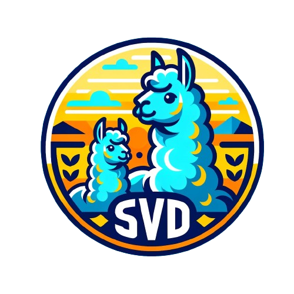

<p align="center">
 <br>
</p>

<div align="center">
<h1>SVD-LLM: Singular Value Decomposition for Large Language Model Compression</h1>
  <div align="center">
  <a href="https://opensource.org/licenses/Apache-2.0">
    
  </a>
  <a href="https://pytorch.org/">
    =v1.7.1">
  </a>
    <a href="https://huggingface.co/docs/transformers/v4.35.2/en/index">
    
  </a>
  <a href="https://github.com/facebookresearch/llama">
    
  </a>
  <a href="https://github.com/facebookresearch/llama">
    
  </a>
  <a href="https://huggingface.co/mistralai/Mistral-7B-v0.1">
    
  </a>
  <a href="https://huggingface.co/facebook/opt-6.7b">
    
  </a>
</div>
</div>

## ✨Roadmap
We are working on the following tasks, please stay tuned!

- [X] Release the code of SVD-LLM.
- [ ] Release the code of SVD-LLM V2.
- [ ] Upgrade the transformers package to the latest version.
- [ ] Update the efficiency evaluation code.
- [ ] Optimize the compression of GQA-based LLMs.


## Introduction
  
> **[SVD-LLM: Truncation-aware Singular Value Decomposition for Large Language Model Compression](https://openreview.net/forum?id=LNYIUouhdt&referrer=%5BAuthor%20Console%5D(%2Fgroup%3Fid%3DICLR.cc%2F2025%2FConference%2FAuthors%23your-submissions))**
> 
> *Xin Wang<sup>1</sup>, Yu Zheng<sup>2</sup>, Zhongwei Wan<sup>1</sup>, Mi Zhang<sup>1</sup>*   
> *<sup>1</sup>The Ohio State University, <sup>2</sup>Michigan State University*
> 
> International Conference on Learning Representations (ICLR) 2025


> **[SVD-LLM V2: Optimizing Singular Value Truncation for Large Language Model Compression](https://arxiv.org/abs/2503.12340)**
> 
> *Xin Wang, Samiul Alam, Zhongwei Wan, Hui Shen, Mi Zhang*  
> *The Ohio State University*
> 
> Annual Conference of the Nations of the Americas Chapter of the Association for Computational Linguistics (NAACL) 2025


## Quick Start

### Installation
Please keep the version of the transformers package exactly equal to 4.35.2 since the svd-compressed version of LLM has a slight change of model structure (in the `component/.` folder).
Create and set up a conda environment with python version 3.9 (newer versions break some dependencies)
```
conda create -n compress python=3.9
conda activate compress
```
Clone and navigate to the repository
```
git clone https://github.com/AIoT-MLSys-Lab/SVD-LLM.git
```
Install requirements.txt
```
pip install -r requirements.txt
```

### Quick Example
```
bash compress_llama.sh
```
This script would compress the LLaMA-7B model under 20\% compression ratio and automatically run the evaluation code, including both perplexity and efficiency of the compressed model.

    
## Step-by-Step Instructions of SVD-LLM
    
### 1. Truncation-Aware Data Whitening + SVD Compression
Under the low compression ratio (recommended ratio <= 0.3), we first run the data whitening of the LLM and saved the weight along with the whitening information.
```
python SVDLLM.py \
--step 1  \
--ratio COMPRESSION_RATIO \
--model HUGGINGFACE_MODEL_REPO \
--whitening_nsamples WHITENING_SAMPLE_NUMBER \
--dataset WHITENING_DATASET \
--seed SAMPLING_SEED \
--model_seq_len MODEL_SEQ_LEN \
--save_path WHITENING_INFO_SAVING_PATH
```

<!-- To compress LLM with larger size, or to run the compression under the resource-constraint platform, we can add `--run_low_resource` to the command. -->


### 2. Parameter Update with Sequential Low-rank Approximation
We first update the compressed weight matrix U and then V with LoRA fine-tuning.
```
python LoRA.py \
--prune_model COMPRESSED_MODEL_PATH \
--data_path yahma/alpaca-cleaned \
--output_dir LORA_OUTPUT_PATH  \
--lora_r 8 \
--num_epochs 2 \
--learning_rate 1e-4 \
--batch_size 64
```

### 3. SVD-LLM + GPTQ
SVD-LLM can also be integrated with quantization methods to achieve a better compression. Here is the example of how to integrate SVD-LLM (20% compression ratio) with GPTQ-4bit to compress LLaMA-7B
```
bash svdllm_gptq.sh
```

### 4. Evaluation
- Perplexity Evaluation:
```
python SVDLLM.py \
--step 4 \
--model_path COMPRESSD_MODEL_SAVING_PATH  \
```
We use the same c4 dataset as in [SparseGPT](https://github.com/IST-DASLab/sparsegpt). Since the original dowload link is invalid, please directly download it from this [link](https://drive.google.com/drive/folders/123Id1MkZVsKySGy_sMO4RgiJKrtPcvUp?usp=sharing) and add the two json files under the `utils/.` folder.
- Efficiency Evaluation:
```
python SVDLLM.py \
--step 5 \
--model_path COMPRESSD_MODEL_SAVING_PATH  \
```
## Citation
If you find this work useful, please cite
```
@inproceedings{wang2025svdllm,
  title={{SVD}-{LLM}: Truncation-aware Singular Value Decomposition for Large Language Model Compression},
  author={Xin Wang and Yu Zheng and Zhongwei Wan and Mi Zhang},
  booktitle={International Conference on Learning Representations (ICLR)},
  year={2025},
  url={https://openreview.net/forum?id=LNYIUouhdt}
}
```
