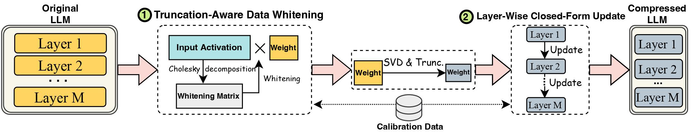

<p align="center">
 <br>
</p>

<div align="center">
<h1>SVD-LLM: Singular Value Decomposition for Large Language Model Compression</h1>
  <div align="center">
  <a href="https://opensource.org/licenses/Apache-2.0">
    
  </a>
  <a href="https://pytorch.org/">
    =v1.7.1">
  </a>
    <a href="https://huggingface.co/docs/transformers/v4.35.2/en/index">
    
  </a>
  <a href="https://github.com/facebookresearch/llama">
    
  </a>
  <a href="https://github.com/facebookresearch/llama">
    
  </a>
  <a href="https://huggingface.co/mistralai/Mistral-7B-v0.1">
    
  </a>
  <a href="https://huggingface.co/facebook/opt-6.7b">
    
  </a>
</div>
</div>

<p align="center">
    
</p>


## Introduction
  
> **[SVD-LLM: Singular Value Decomposition for Large Language Model Compression](https://arxiv.org/abs/2403.07378)** [[arXiv]](https://arxiv.org/abs/2403.07378)   
> *Xin Wang<sup>1</sup>, Yu Zheng<sup>2</sup>, Zhongwei Wan<sup>1</sup>, Mi Zhang<sup>1</sup>*   
> *<sup>1</sup>The Ohio State University, <sup>2</sup>Michigan State University*  

### Key Designs
-  **Truncation-Aware Data Whitening**: Ensure truncating smaller singular values has lower compression loss. 
-  **Layer-Wise Closed-Form Update**: Compensate for accuracy degradation under high compression ratio.  

### Abstract
The advancements in Large Language Models (LLMs) have been hindered by their substantial sizes, which necessitate LLM compression methods for practical deployment. Singular Value Decomposition (SVD) offers a promising solution for LLM compression. However, state-of-the-art SVD-based LLM compression methods have two key limitations: truncating smaller singular values may lead to higher compression loss, and the lack of update on the compressed weight after SVD truncation. In this work, we propose SVD-LLM, a new SVD-based LLM compression method that addresses the limitations of existing methods. SVD-LLM incorporates a truncation-aware data whitening strategy to ensure a direct mapping between singular values and compression loss. Moreover, SVD-LLM adopts a layer-wise closed-form model parameter update strategy to compensate for accuracy degradation under high compression ratios. We evaluate SVD-LLM on a total of 10 datasets and eight models from three different LLM families at four different scales. Our results demonstrate the superiority of SVD-LLM over state-of-the-arts, especially at high model compression ratios.

## Quick Start

### Installation
Please keep the version of the transformers package exactly equal to 4.35.2 since the svd-compressed version of LLM has a slight change of model structure (in the `component/.` folder).
```
pip install -r requirements.txt
```

### Quick Example
```
bash compress_llama.sh
```
This script would compress the LLaMA-7B model under 20\% compression ratio and automatically run the evaluation code, including both perplexity and efficiency of the compressed model.

    
## Step-by-Step Instructions  
    
We implement SVD-LLM with two different pipelines:
* Truncation-Aware Data Whitening + SVD Compression (used under **low** compression ratio)
* Truncation-Aware Data Whitening + SVD Compression + <u>Layer-Wise Closed-Form Update</u> (used under **high** compression ratio)
  
    
### 1. Truncation-Aware Data Whitening + SVD Compression (Used under low compression ratio)
Under the low compression ratio (recommended ratio <= 0.3), we first run the data whitening of the LLM and saved the weight along with the whitening information.
```
python SVDLLM.py \
--step 1  \
--ratio COMPRESSION_RATIO \
--model HUGGINGFACE_MODEL_REPO \
--whitening_nsamples WHITENING_SAMPLE_NUMBER \
--dataset WHITENING_DATASET \
--seed SAMPLING_SEED \
--model_seq_len MODEL_SEQ_LEN \
--save_path WHITENING_INFO_SAVING_PATH
```

<!-- To compress LLM with larger size, or to run the compression under the resource-constraint platform, we can add `--run_low_resource` to the command. -->


### 2. Truncation-Aware Data Whitening + SVD Compression + Layer-Wise Closed-Form Update (Used under high compression ratio)
Under the high compression ratio (recommended ratio > 0.3), we can further apply layer-wise closed-form update to update the weight matrix after the first pipeline to improve accuracy.

```
python SVDLLM.py \
--step 2  \
--ratio COMPRESSION_RATIO \
--model HUGGINGFACE_MODEL_REPO \
--whitening_nsamples WHITENING_SAMPLE_NUMBER \
--updating_nsamples UPDATING_SAMPLE_NUMBER \
--dataset WHITENING_DATASET \
--seed SAMPLING_SEED \
--model_seq_len MODEL_SEQ_LEN \
--save_path WHITENING_INFO_SAVING_PATH
```


### 3. SVD Compression + Layer-Wise Closed-Form Update (Although not the best but still better than exsiting baselines)
We also provide the implementation to run layer-wise closed-form update only in SVD-LLM. Although this version is not as good as the above two versions of SVD-LLM, it is still better than the existing baselines.

```
python SVDLLM.py \
--step 3  \
--ratio COMPRESSION_RATIO \
--model HUGGINGFACE_MODEL_REPO \
--updating_nsamples UPDATING_SAMPLE_NUMBER \
--dataset WHITENING_DATASET \
--seed SAMPLING_SEED \
--model_seq_len MODEL_SEQ_LEN \
--save_path WHITENING_INFO_SAVING_PATH
```

### 4. LoRA Fine-Tuning
The compressed model from either of the two pipelines above can also be combined with LoRA fine-tuning to get a better accuracy. We borrowed the LoRA fine-tuning code from [LLM-Pruner](https://github.com/horseee/LLM-Pruner) with the same configuration.
```
python LoRA.py \
--prune_model COMPRESSED_MODEL_PATH \
--data_path yahma/alpaca-cleaned \
--output_dir LORA_OUTPUT_PATH  \
--lora_r 8 \
--num_epochs 2 \
--learning_rate 1e-4 \
--batch_size 64
```

### 5. SVD-LLM + GPTQ
SVD-LLM can also be integrated with quantization methods to achieve a better compression. Here is the example of how to integrate SVD-LLM (20% compression ratio) with GPTQ-4bit to compress LLaMA-7B
```
bash svdllm_gptq.sh
```

### 6. Evaluation
- Perplexity Evaluation:
```
python SVDLLM.py \
--step 4 \
--model_path COMPRESSD_MODEL_SAVING_PATH  \
```
We use the same c4 dataset as in [SparseGPT](https://github.com/IST-DASLab/sparsegpt). Since the original dowload link is invalid, please directly download it from this [link](https://drive.google.com/drive/folders/123Id1MkZVsKySGy_sMO4RgiJKrtPcvUp?usp=sharing) and add the two json files under the `utils/.` folder.
- Efficiency Evaluation:
```
python SVDLLM.py \
--step 5 \
--model_path COMPRESSD_MODEL_SAVING_PATH  \
```
## Citation
If you find this work useful, please cite
```
@article{wang2024svd,
  title={Svd-llm: Truncation-aware singular value decomposition for large language model compression},
  author={Wang, Xin and Zheng, Yu and Wan, Zhongwei and Zhang, Mi},
  journal={arXiv preprint arXiv:2403.07378},
  year={2024}
}
```
